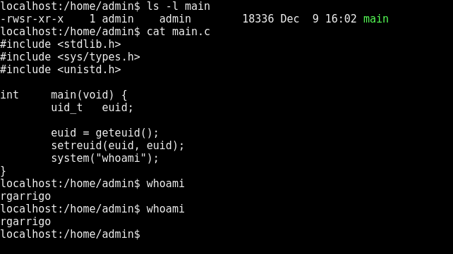

## level0

### Theme
Get familiar with decompilation and the setuid bit.

### Documentation

#### Decompilation
One can use 'objdump' to desassemble the machine code and decompile the code hand.
Or one can use an automatic decompiler like Ghidra/BinaryNinja/angr.

#### uid, euid, suid
A process has several user ids associated with it:

- uid, or real user id; Id of the user who launched the process
- euid, or effective user id; Id of the permission level of the process
- suid, or saved user id; A way to store a user id

In practice, with euid='admin_id', you have the same rights as the user 'admin'.

#### Setuid bit
Setuid bit is a file permission flag in an UNIX operating system.
When a file with this flag is executed, the euid is set to the file's owner user id.

When executing such file, you have the same rights as the owner of the file.

#### setreuid
With the documentation above, one can expect the following:

{ width=100% }

However, on a modern OS, this happens:

{ width=100% }

This is because the implementation of 'whoami' begins with 'euid = uid':
```C
[...]
uid_t   uid;

uid = getuid();
seteuid(uid);
[...]
```

'whoami' does not need permission elevation.
It is therefore best practice to restrain permissions to the ones of the user who launched the process.

Thus, on modern OS, one need to do 'uid = euid' before executing another program:

{ width=100% }

### The exploit
Decompilation shows that './level0' wants its first argument to be '0x1a7'.
```C
[...]
if (atoi(argv[1]) != 0x1a7)
{
    write(1, "No !\n", 5);
    return (0);
}
[...]
```

'0x1a7' is '423' in decimal notation.
Therefore, entering './level0 423' executes the rest of the code.
```C
[...]
args[0] = strdup("/bin/sh");
args[1] = 0;
egid = getegid();
euid = geteuid();
setresgid(egid, egid, egid);
setresuid(euid, euid, euid);
execv("/bin/sh", args);
[...]
```

The setuid bit is set for the executable './level0'.
Furthermore, './level0' is owned by 'level1'.
'/bin/sh' will therefore be launched as 'level1'.

With this shell, we cat the password of 'level1'.
